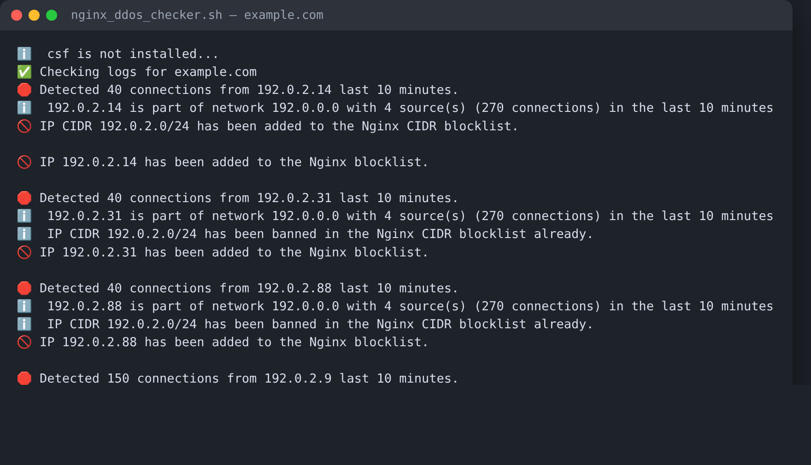

# nginx-ddos-checker

```
╔═══════════════════════════════════════════════════════════════════╗
║                        Nginx DDoS Checker                         ║
║        DDoS detection and banning for Nginx access logs           ║
║                       Maintained by @tmiland                      ║
╚═══════════════════════════════════════════════════════════════════╝
```

[](https://github.com/tmiland/nginx-ddos-checker/commits/main)
[](https://github.com/tmiland/nginx-ddos-checker/stargazers)
[](https://github.com/tmiland/nginx-ddos-checker/issues)


A lightweight Bash daemon that watches Nginx access logs for DDoS patterns and
bans offenders through **csf firewall**, **Nginx blocklists** and/or
**AbuseIPDB**. Runs as a single script, polls every 60 seconds, no
dependencies beyond standard GNU tooling.



*Example run against simulated attack traffic (RFC 5737 documentation IPs).*

## Features

- **Per-domain detection** — discovers virtual hosts automatically from
  `<domain>_access_log` files in your log directory
- **Two detection windows** — a short per-IP threshold and a longer
  high-volume threshold, both configurable in minutes
- **Distributed attack awareness** — separates lone high-rate sources from
  coordinated botnets and bans the exact IP or the whole /24 accordingly,
  to avoid banning innocent cloud users
- **csf firewall integration** — temporary bans with configurable bantime
- **Nginx-layer blocking** — plain IP blocklist and/or CIDR blocklist, with
  automatic Nginx reload
- **tcpkill support** — kill established connections from an offending IP
- **AbuseIPDB reporting** — immediate (direct) reports, queued bulk reports
  on an interval, or both: falls back automatically when a rate limit is hit
- **Exclusions** — skip domains and IPs you trust
- **Per-domain attack status** — reports which offenders are still blocked,
  at which layer, and whether they were reported

## How it works

1. Reads configuration from `nginx_ddos_checker.ini` (auto-created from the
   example on first run)
2. Discovers virtual hosts by listing `*_access_log` files in
   `nginx_logs_path` (virtualmin-style layouts work out of the box)
3. For each domain, counts requests per IP inside the `timeframe` and
   `additional_timeframe` windows
4. Flags IPs above `threshold`, then classifies each offender:
   - **Lone high-rate source** → ban exact IP (once combined requests exceed
     `total_threshold`)
   - **Distributed attack** (≥ 3 sources in the same /8, each individually
     meaningful) → ban the /24 CIDR instead
5. Enforces through the enabled backends: csf, Nginx blocklists, tcpkill,
   AbuseIPDB
6. Sleeps 60 seconds and repeats

## Requirements

- Bash and GNU tooling (`grep -P`, `awk`, `sed`, `date`)
- Nginx access logs in `<domain>_access_log` naming
- Optional: [csf firewall](https://configserver.com/cp/csf.html), `tcpkill`,
  `jq` (bulk report rate-limit detection), AbuseIPDB API key

## Install

```bash
git clone https://github.com/tmiland/nginx-ddos-checker.git
cd nginx-ddos-checker

# Edit the config (created automatically on first run if missing)
cp example_nginx_ddos_checker.ini nginx_ddos_checker.ini
```

`abuseipdb_token` is a **file path** — the script reads your API key from the
file's contents, keeping the key out of the config itself:

```bash
echo "YOUR_ABUSEIPDB_API_KEY" > /root/.tokens/.abuseipdb-token
chmod 600 /root/.tokens/.abuseipdb-token
```

### Run as a service (systemd + screen)

The included `nginx_ddos-checker.service` keeps the daemon in a named screen
session, so you can always attach and watch it live:

```bash
cp nginx_ddos-checker.service /etc/systemd/system/
systemctl daemon-reload
systemctl enable --now nginx_ddos-checker

# Attach to the live session
screen -r nginx_ddos_checker
```

Or run it manually:

```bash
./nginx_ddos_checker.sh
# Verbose/debug mode:
./nginx_ddos_checker.sh debug
```

## Configuration

`nginx_ddos_checker.ini` (single-line `key=value` entries):

| Key | Default | Description |
|-----|---------|-------------|
| `nginx_logs_path` | `/var/log/virtualmin` | Directory containing the access logs |
| `nginx_blocklist` | | Path to plain IP blocklist (one IP per line) |
| `nginx_block` | `false` | Enable the plain IP blocklist |
| `nginx_cidr_blocklist` | | Path to CIDR blocklist (`deny <cidr>;` format) |
| `nginx_cidr` | `false` | Enable the CIDR blocklist |
| `excluded_domains` | | Comma-separated domains to skip |
| `excluded_ips` | | Comma-separated IPs to skip |
| `timeframe` | `10` | Detection window in **minutes** |
| `threshold` | `30` | Per-IP requests within `timeframe` to trigger a flag |
| `additional_threshold` | `100` | High-volume per-IP threshold |
| `additional_timeframe` | `10` | Second detection window in **minutes** |
| `total_threshold` | `100` | Combined requests (both windows) to ban a lone source |
| `bantime` | `7200` | csf temp-ban duration in seconds |
| `abuseipdb_token` | | **Path to a file** containing the AbuseIPDB API key |
| `abuseipdb_report` | `false` | Enable AbuseIPDB reporting |
| `abuseipdb_report_method` | `bulk` | `bulk` (queue + interval submit) or `direct` (immediate) |
| `abuseipdb_log_folder` | `/var/log/abuseipdb` | Where reports and queues are stored |
| `abuseipdb_bulk_report_interval` | `1hour` | Bulk submission interval (`1hour`/`30min`) |
| `csf` | `false` | Enable csf firewall bans |
| `tcp_kill` | `false` | Enable tcpkill on offending connections |

## AbuseIPDB reporting

Two methods, with automatic fallback:

- **direct** — reports each banned IP immediately
- **bulk** — queues offenders in a CSV and submits on an interval
  (`abuseipdb_bulk_report_interval`), respecting AbuseIPDB's rate limits

If the active method hits a rate limit (HTTP 429), the script switches to the
other one for that IP. Bulk submissions only clear the queue on a confirmed
HTTP 200, so nothing is silently dropped.

## Credits

Forked from [codingcowde/ddos-checker](https://github.com/codingcowde/ddos-checker)
— reworked with distributed attack classification, AbuseIPDB integration
(direct/bulk/fallback), CIDR-aware banning and a per-domain attack status view.
